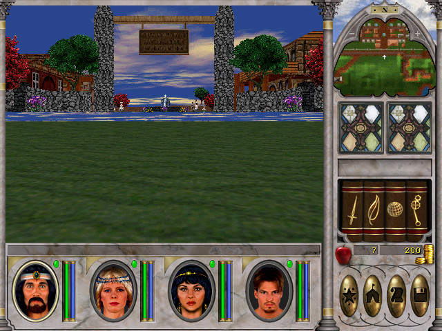
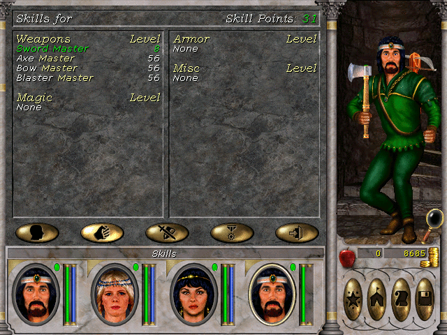
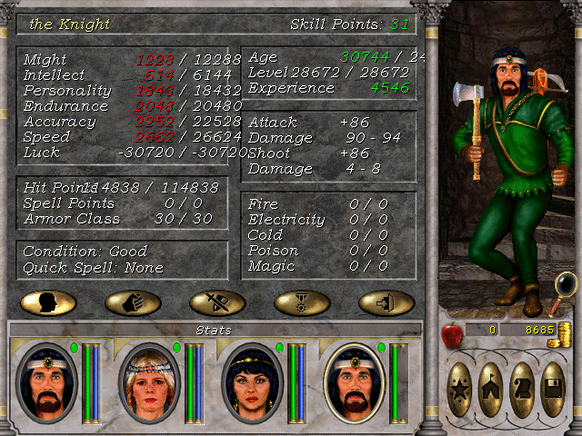
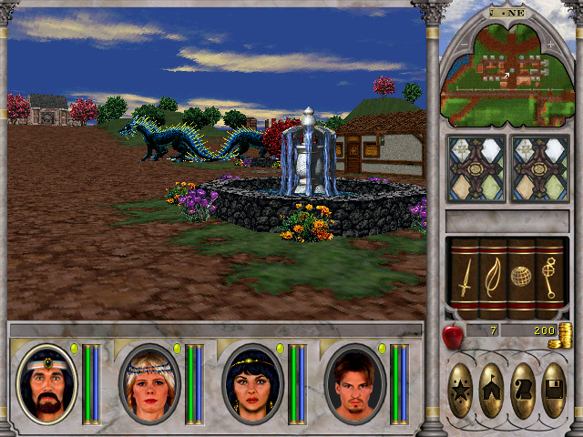

## Warps

### FMV warp

*Warps party to coordinates where FMV glitch happened (usually coach or boat) but on a different map.*

[Example](https://youtu.be/BZKSQfjaOCI?t=55)

1. Save in front of a map edge / entrance (which has no FMV, like Dragonsand TP from New Soprigal)
2. Visit any stables or boat and travel
3. While traveling click on a portrait of any character in party
4. Load the save from step 1.  
* If it's a map edge: just walk into it and confirm. 
* If it's an entrance: save and click on the entrance (saving unlocks interaction).
5. Save and restart the game (to get rid of the cutscene overlapping the screen) or save and load any save in front of something that starts an FMV cutscene (like a house door for example) save the game (to unlock interaction) and click to use, that should fix it. Afterwards just load the save, made after map transition, to continue.

### Crash warp

*Allows to warp from one map edge to another, and travel to 0 coordinates in dungeons.*

[Example](https://www.youtube.com/watch?v=5jHVgbGngKI)

*Requires 1 Enchant Item scroll*

1. Take an Enchant Item scroll
2. Go to the Save Game screen
3. Use Enchant Item scroll
4. Enter dungeon / area
5. The game will crash here, click accept
6. Load the autosave

Possible results:

*More or less consistent things, it all depends on area/dungeon*

* Nothing happens and autosave is not generated
* Party enters normally, without a crash in the first place
* Party enters and gets warped to 0.0.0 + on some indoor areas monsters might disappear. 

### 1 Enemy arena

[Example](https://www.youtube.com/watch?v=JrkNVn25N9s)

1. Take an Enchant Item scroll
2. Go to the Save Game screen
3. Use Enchant Item scroll
4. Use coach to enter Arena
5. On exit, the game will crash, but generate an autosave, outside, at Castle Ironfist.

## 5th Slot

5th slot related glitches will only work before any progression is done. Completing a big portion of quests (for example turning in scroll to Andover Potbello and such) will make the game crash when swapping characters.

[Data affected by 5th slot](https://docs.google.com/spreadsheets/d/1S2NUpGPmsXoLPuPY117Ws7Vzqr3JirfJKkctUYt1mm8/edit?usp=sharing)

**Swap** means ```CTRL + Click``` on a character while others recovering

* Restarting the game clears the blue color effect.
* Swapping characters can lead to them receiving buffs and dying. If character is buffed it will usually lead to crashes during resting / training / map crossing and such. Dying (party) removes all the effects and allows party to travel without crashing.
* Swapping characters can lead to screen going blue, currently there is no way to remove it other than by restarting the game.


### Small hitbox

Makes the eye level 0 which significantly reduces the party's hitbox.



[Example](https://www.youtube.com/watch?v=BZKSQfjaOCI)

1. Start a new game
2. Lose turn with every character and start clicking on the inactive ones
3. You need to swap every character until the entire party is dead so that the game restarts
4. Swap character with name **the Knight**. He's usually the first one if swapping was done in sequential order.
5. Start a new game.

### Transferring characters between saves

1. While in the game where you want to transfer a character swap any character slot while everyone is recovering. That will usually make the party immovable.
2. Make a save.
3. Swap the character slot, from step 1, 1 more time to revert everything.
4. Now load any other save and swap the character you want to receive in the save earlier
5. Load the save made in step 2.
6. Swap back the character slot from step 1.

### Free Haven Knight

Swapping character in Free Haven while everyone is recovering will place the Knight character in the party with the following stats:





It seems that swapping twice anywhere updates the 5th slot character slot (the one that is not in the party), which allows to get him into the party:

1. Swap any character
2. Make a save
3. Swap back to revert back to normal
4. Travel to Free Haven
5. Swap any character twice
6. Load the save from step 2
7. Swap back the character slot from step 1

That will bring the Knight from Free Haven into the party, however he will be debuffed and dead. There are 2 way to go about it:

1. Kill the party. Killing the party will get rid of the debuffs / buffs and resurrect the Knight allowing party to travel freely without crashing.
2. Use master healer or temple to resurrect the Knight. However since the buffs are still on, map crossing / resting / training will crash the game.  

*After healing the Knight will have 150 hit points. This is much lower than what he can have. If you were to get rid of all the debuffs and update his stats, his hp will be around 100k. Using LVL well at Kriegspire updates the HP back to normal even if the Knight is buffed, resting after dying does too.*

### Saving positions in dungeons

[Example](https://www.youtube.com/watch?v=zs-DbFSWC6c)

The position of the party is being saved when swapping characters in indoor areas. That allows to set up to 3 locations and jump to them later on either in the same dungeon or on some outdoor map. 

## Misc

### Dragonsand in New Sorpigal

[Example](https://www.youtube.com/watch?v=5Fh8MFRhlwc)

*Sets monster and chest data from Dragonsand at New Sorpigal.*



Requirements:

* Right now only tested to work on the first day of the game (January 1st)
* 1 Enchant item scroll

Steps:

1. Start the game and find 1 Enchant item scroll (make sure to do it on the first day)
2. Travel to Dragonsand
3. Take Enchant Item scroll and go to the Save Game screen
4. Use Enchant Item scroll
5. Start a new game (Quick Start)

If everything went correctly:

* Monsters in New Sorpigal will be replaced with monsters from Dragonsand 
* The contents of chests will be replaced as well, which allows to access Obelisk chest without doing the quest.

Possible results:

* If it's not the first day, monsters in New Sorpigal may not spawn

*Currently works only with Dragonsand.*

### Resurrecting with Shrine of the Gods

Eradicated character can be resurrected by using Shrine of the Gods repeatedly:

[Example](https://www.youtube.com/watch?v=gIbNAzGpxQo)

Lose turn for every character and then repeatedly press space.

## Followers

### Hover glitch

[Example](https://www.youtube.com/watch?v=4cPhH3blMiY)

In VI there is no "0" follower. So to get the hover bug to happen you need 2 NPCs instead of 1 otherwise the game crashes.

Right-clicking on the portraits of the followers gives them focus, even when the portrait is not visible it still gets the input.

### Duplicating followers

#### Duplicating followers outdoors

[Example](https://www.youtube.com/watch?v=OjpaKvFsqv0)

After duplicating the game treats new followers as normal, even if the original ones were of quest type. Dying (as party) makes them to become of quest type, they do not disappear.

*For some reason to make the first copy you need to hire twice, the third copy will be added right away. It's almost like adding 2 followers instead of 1, although it shows only 1.*

#### Duplicating house followers:

[Example](https://www.youtube.com/watch?v=_bsuRdky0AI)

#### Swapping followers (no way to do it yet)

In VII there is a way to get new followers by dismissing the existing ones, you will be getting -2 to follower id you dismissed last.

Right now dismissing quest followers in VI crashes the game.

That is why the only new follower it is possible to get is a follower made of 2 normal ones (not of quest type): 99 Helen Teal

[Example](https://www.youtube.com/watch?v=elAp4CkvAGM)

Why does it give us NPC with the ID 99 is yet unknown. (It is 11 in VII)

## Fun

### Olutta glitch

[Example](https://www.youtube.com/watch?v=QHFpIo0ijPE)

*Make sure the game has no progress of any kind (quests, guilds)*

1. Go to the wall that warps to Dragonsand at New Sorpigal.
2. Swap the 4th slot twice (ctrl+click when no one has a turn). Sometimes the image won't update so you'd need to move a little.
3. Swap again once
4. Click on the wall and exit the game right after
5. Load the autosave first then save made in the first step (any other save will probably work too)

*At that point the game will do weird things, especially if swapping 5th slot*

### Happy Zoltan

[Example](https://www.youtube.com/watch?v=Q2jROOC_NVU)

Visit the Kriegspire well that warps to Castle Kriegspire and do the same as with Olutta glitch.